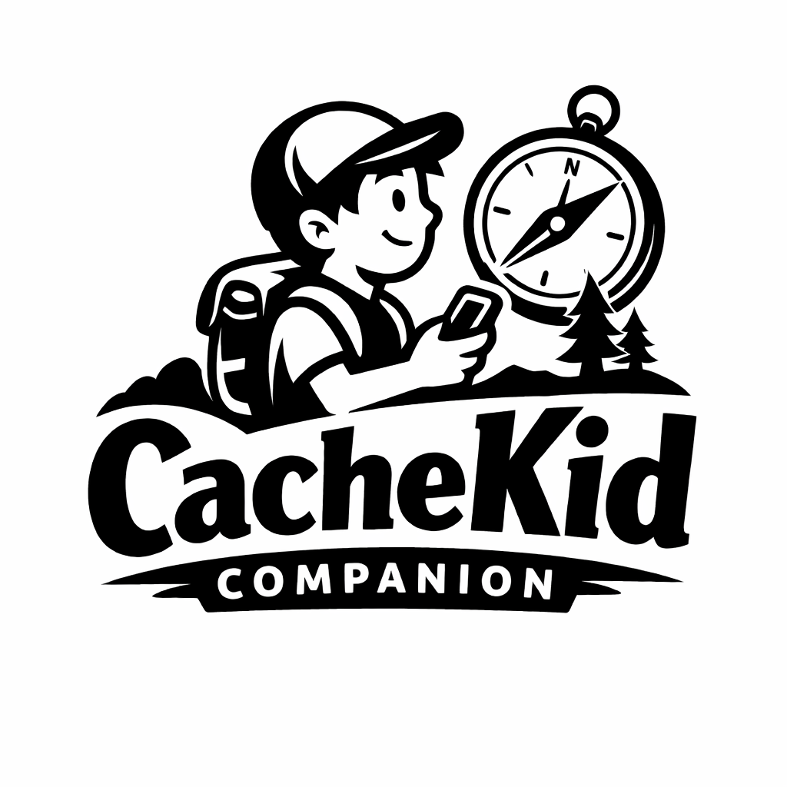

# CacheKidCompanion



Kid-friendly geocaching companion with e-ink display: follow the arrow, not an app.

## Current state

This repository now contains the first working host-side mission intake flow.

Implemented:

- Android host app in Kotlin with a local WebView UI
- browser-side navigation math for target bearing, distance, and arrow direction
- browser geolocation fallback
- Android host bridge with:
  - native permission request hook
  - native heading stream from Android rotation sensor
  - native location stream from Android `LocationManager`
  - BLE capability status hook
- versioned host mission domain:
  - `MissionDraft`
  - `MissionTarget`
  - mission package schema and manifest types
- smartphone host share intake:
  - `ACTION_SEND` text payloads
  - `coord.info/GC...` links
  - partial vs resolved import states
- first parent-side resolution flow:
  - detect shared cache code
  - manually complete missing title and coordinates
  - create a `MissionDraft`
- simple e-ink-friendly black/white UI

## Architecture

The current implementation is an Android host app with a WebView-based UI shell.

The split today is:

- `host domain`
  - cache import parsing
  - resolution state
  - mission draft creation
- `android host`
  - intent entrypoint
  - permission management
  - native sensor collection
  - future BLE and e-ink specific integrations
- `web ui shell`
  - navigation display
  - parent-side review widgets
  - browser geolocation fallback

The bridge contract is intentionally capability-driven. The UI can fall back to browser features when `window.AndroidHost` is absent, but the smartphone host is the primary runtime for cache intake.

### Data flow

```text
Geocaching App on Smartphone
        |
        | share link, usually coord.info/GC...
        v
CacheKid Host App on Smartphone
        |
        | extract GC code
        | resolve cache online
        | build MissionDraft / MissionPackage
        v
Local transfer to Meebook
        |
        | hotspot / local Wi-Fi / later transfer channel
        v
CacheKid Kid App on Meebook
        |
        | store mission locally
        | render map, route, and treasure target
        | use on-device GPS / heading
        v
Offline kid navigation experience
```

Rule of thumb:

- smartphone = online host and mission builder
- Meebook = offline mission player

### Component flow

```text
Smartphone host app
-------------------
Share Intent
  -> SharedCacheParser
  -> partial import (GC code / link / maybe title)
  -> cache resolver
      -> complete cache data immediately
      -> or manual completion now
      -> or online resolution later on smartphone
  -> MissionDraft
  -> MissionPackage writer
  -> local transfer client

Meebook kid app
---------------
local transfer receiver
  -> MissionPackage validator
  -> local mission storage
  -> offline map renderer
  -> route / waypoint / X overlays
  -> kid-facing navigation UI
  -> GPS / heading providers
```

## BLE integration

The BLE path is host-only and not sensor-specific yet.

You need to replace the placeholder UUIDs in:

- `app/src/main/java/com/cachekid/companion/data/BleSensorConfig.kt`

After that, the next step is to add:

- BLE scan by service UUID
- GATT connection
- characteristic notifications for heading / gyro / angle
- forwarding parsed values through the existing JS bridge

## Run

Open the project in Android Studio and let it create or sync the Gradle wrapper locally if needed.

The Android host loads:

- `file:///android_asset/web/index.html`

Default target coordinate on first launch:

- `52.520008,13.404954`

## Next steps

Recommended next implementation steps:

1. Turn `MissionDraft` into a persistable `MissionPackage`.
2. Add local storage for prepared missions on the host side.
3. Implement device-to-device transfer from smartphone host to Meebook.
4. Add real smartphone-side online cache resolution behind the current manual completion step.
5. Continue separating parent setup UI from the eventual child-only mission view.

## Engineering workflow

Repository rules are intentionally strict:

- `main` should only be updated through pull requests
- frontend and Android unit tests are expected to stay green in GitHub Actions
- non-trivial changes should reference an issue
- refactors are expected when a feature would otherwise increase coupling or duplication

See `CONTRIBUTING.md` for the full contribution rules and pull request expectations.
